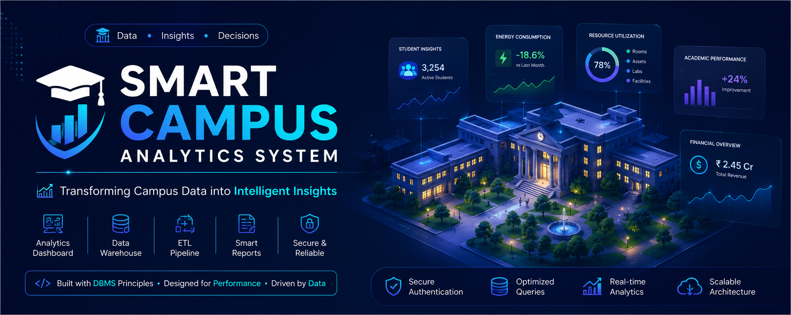
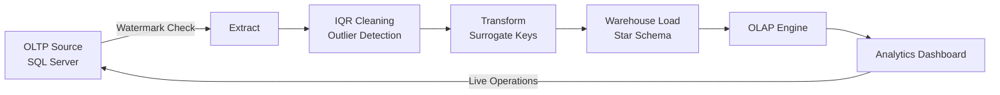
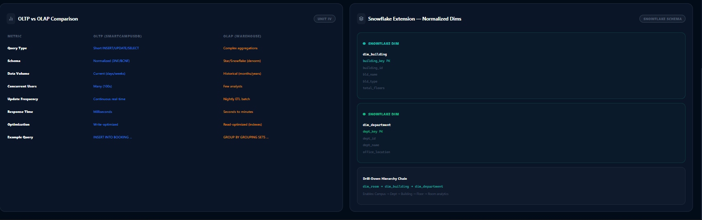
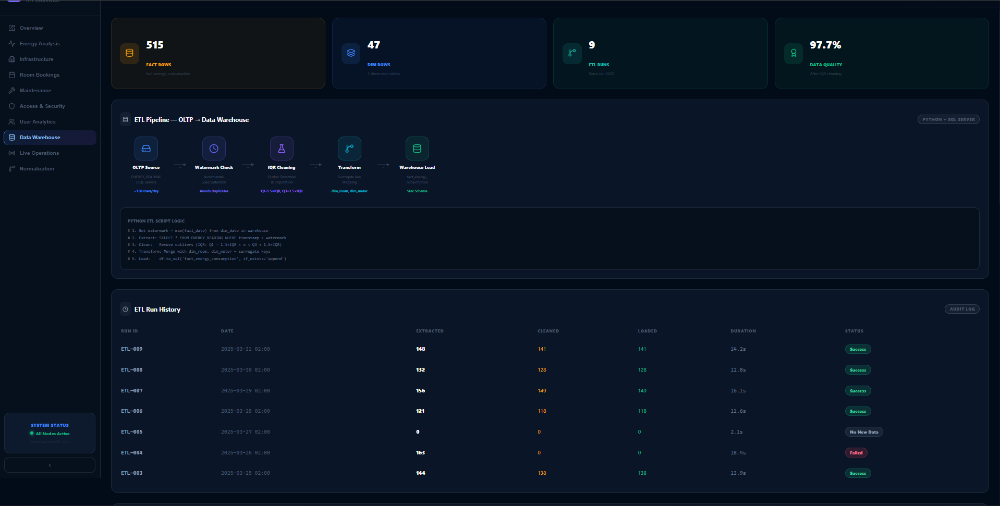
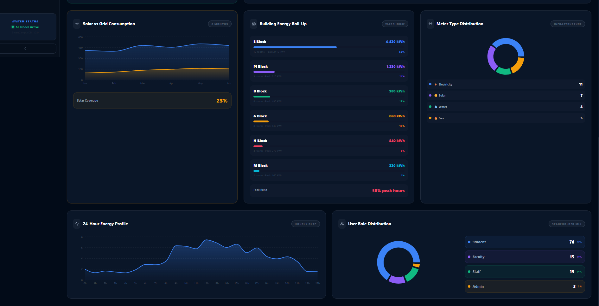
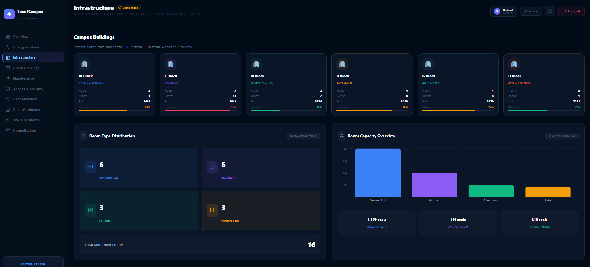
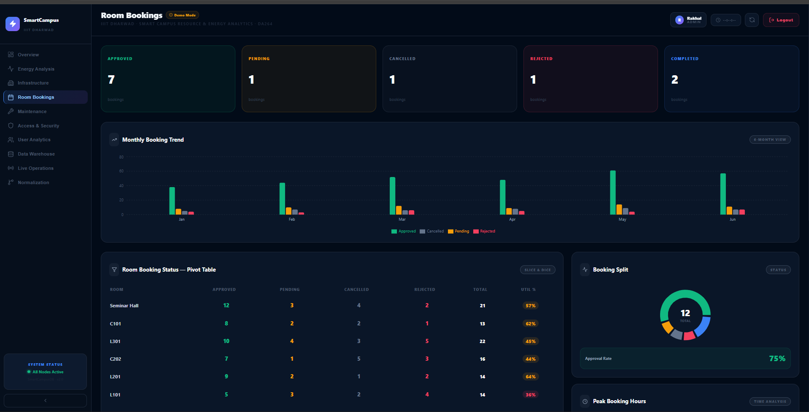
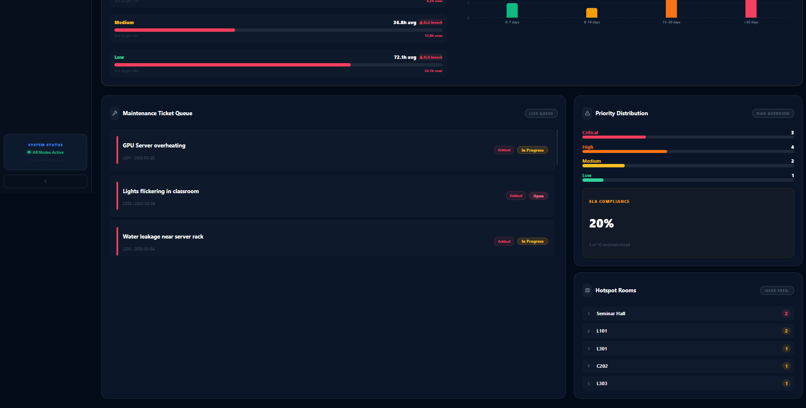
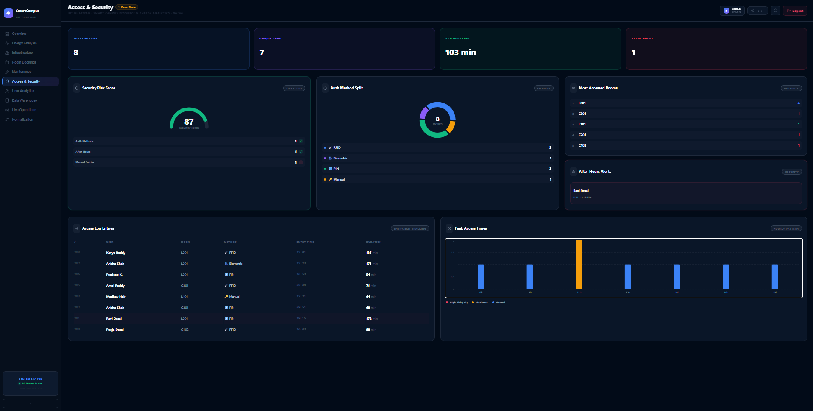
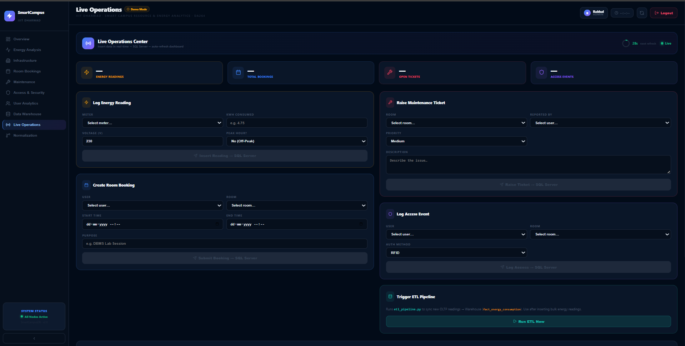

<p align="center">
  
</p>

<h1 align="center">🏫 Smart Campus – Resource & Energy Analytics System</h1>
<p align="center"><b>IIIT Dharwad</b> · A full-stack Data Warehousing &amp; Analytics platform built on core DBMS principles</p>

<p align="center">
  
  
  
  
  
  
</p>

<p align="center">
  <a href="#-features">Features</a> •
  <a href="#-tech-stack">Tech Stack</a> •
  <a href="#-database-design">Database Design</a> •
  <a href="#-etl-pipeline">ETL Pipeline</a> •
  <a href="#-ui-showcase">UI Showcase</a> •
  <a href="#-installation--setup">Installation</a> •
  <a href="#-recruiter-highlights">Recruiter Highlights</a>
</p>

---

## 📌 Overview

**Smart Campus Analytics System** is an end-to-end data platform that models the daily operations of a university campus — energy consumption, room bookings, maintenance tickets, access & security logs, and user activity — and turns them into actionable insights through a proper **OLTP → ETL → OLAP** data warehouse pipeline.

The project was built to demonstrate practical, production-style application of core **Database Management System (DBMS)** concepts: normalized transactional schemas, star-schema data warehousing, incremental ETL with watermarking, OLAP operations (roll-up, drill-down, slice, dice, pivot), and a Snowflake-schema extension — all wrapped in a live, interactive analytics dashboard.

> 💡 The dashboard runs in a **Demo Mode** that showcases the platform against realistic seeded campus data (109 users, 16 rooms, 27 energy meters, 200+ bookings, 515 warehouse fact rows) while remaining fully wired to insert **live data into SQL Server**.

---

## 🎯 Problem Statement

Campuses generate a continuous stream of operational data — energy meter readings, room booking requests, access logs, maintenance complaints — but most institutions have **no unified system** to:

- Track real-time resource utilization (rooms, energy, equipment)
- Detect anomalies (energy spikes, SLA breaches, security risks)
- Analyze historical trends across departments, buildings, and time
- Support data-driven decisions using clean, warehoused data rather than raw transactional tables

## ✅ Objectives

- Design a normalized **OLTP schema** to reliably capture live campus transactions
- Build a **star-schema data warehouse** optimized for analytical queries
- Implement an **incremental ETL pipeline** (Python + SQL Server) with outlier cleaning
- Demonstrate **OLAP operations** (roll-up, drill-down, slice, dice, pivot) with real SQL
- Provide a **Snowflake schema extension** for further dimension normalization
- Deliver a recruiter-ready, interactive analytics dashboard across 9 modules

---

## ✨ Features

| Module | Description |
|---|---|
| 📊 **Overview** | Campus-wide KPIs, live health score, dual-axis weekly trend |
| ⚡ **Energy Analysis** | Room/department energy breakdown, heatmaps, solar vs grid, CO₂ tracking, anomaly detection |
| 🏢 **Infrastructure** | Building utilization, room type distribution, equipment & IoT node registry |
| 📅 **Room Bookings** | Approval workflow, monthly trends, pivot table, peak-hour analysis |
| 🔧 **Maintenance** | Ticket queue, MTTR/SLA analytics, priority distribution, ticket aging |
| 🔐 **Access & Security** | Entry logs, auth-method split, security risk score, after-hours alerts |
| 👥 **User Analytics** | Role distribution, department activity, engagement quadrant, activity ranking |
| 🗃 **Data Warehouse** | Live ETL monitor, star schema explorer, interactive OLAP console |
| 📡 **Live Operations** | Real-time forms to insert readings, bookings, tickets & access events directly into SQL Server, plus one-click ETL trigger |

---

## 🛠 Tech Stack

<table>
<tr>
<td valign="top" width="33%">

**Database**
- SQL Server (OLTP)
- Star / Snowflake Schema (OLAP)
- T-SQL (Window Functions, CTEs, GROUPING SETS)

</td>
<td valign="top" width="33%">

**ETL & Backend**
- Python (pandas, pyodbc)
- Incremental watermark-based extraction
- IQR-based outlier cleaning

</td>
<td valign="top" width="33%">

**Frontend / Dashboard**
- React / Streamlit-style analytics UI
- Recharts / chart components
- Responsive dark-themed dashboard

</td>
</tr>
</table>

---

## 🏗 Architecture



**Flow summary:** Live campus transactions (room bookings, energy readings, maintenance tickets, access logs) are written into a normalized OLTP database. A Python ETL script incrementally extracts new rows since the last watermark, cleans outliers using the IQR method, transforms them with surrogate keys, and loads them into a dimensional **star schema** warehouse — which powers all analytics, OLAP operations, and reporting in the dashboard.

---

## 📁 Folder Structure

```
DBMS_SMART_CAMPUS_ANALYTICS_SYSTEM/
│
├── assets/
│   └── images/
│       ├── hero-banner.png
│       ├── overview-dashboard.png
│       ├── energy-analysis-dashboard.png
│       ├── energy-analysis-building-breakdown.png
│       ├── energy-anomaly-detection.png
│       ├── infrastructure-campus-buildings.png
│       ├── equipment-iot-network-summary.png
│       ├── room-bookings-dashboard.png
│       ├── room-booking-registry.png
│       ├── maintenance-dashboard-overview.png
│       ├── maintenance-ticket-queue-priority.png
│       ├── access-security-dashboard.png
│       ├── user-analytics-dashboard.png
│       ├── etl-pipeline-monitor.png
│       ├── star-schema-olap-explorer.png
│       ├── oltp-olap-comparison.png
│       └── live-operations-center.png
│
├── README.md
```

---

## 🗄 Database Design

### Entity Overview (OLTP)

The transactional schema (`SmartCampusDB`) is normalized to **3NF/BCNF** and includes core entities such as Users, Rooms, Buildings, Bookings, Energy Readings, Maintenance Tickets, and Access Logs, tracking day-to-day campus operations with millisecond response times and support for hundreds of concurrent users.

### ER Diagram / Star Schema

<p align="center">
  
</p>

*Fact table `fact_energy_consumption` (515 rows) sits at the center, connected to three dimension tables — `dim_date` (365 rows), `dim_room` (16 rows), and `dim_meter` (27 rows) — enabling fast, pre-aggregated analytical queries.*

### OLTP vs OLAP

<p align="center">
  
</p>

| Metric | OLTP (SmartCampusDB) | OLAP (Warehouse) |
|---|---|---|
| Query Type | Short INSERT/UPDATE/SELECT | Complex aggregations |
| Schema | Normalized (3NF/BCNF) | Star/Snowflake (denormalized) |
| Data Volume | Current (days/weeks) | Historical (months/years) |
| Concurrent Users | Many (100s) | Few analysts |
| Update Frequency | Continuous real-time | Nightly ETL batch |
| Response Time | Milliseconds | Seconds to minutes |
| Optimization | Write-optimized | Read-optimized (indexes) |

### Snowflake Schema Extension

The warehouse is further extended into a **snowflake schema** by normalizing dimensions such as `dim_building` and `dim_department`, enabling a full drill-down hierarchy chain: `dim_room → dim_building → dim_department`, which supports Campus → Department → Building → Floor → Room analytics.

---

## 🔄 ETL Pipeline

<p align="center">
  
</p>

The ETL pipeline (`etl_pipeline.py`) runs on a **watermark-based incremental load** strategy:

```python
# 1. Get watermark — max(full_date) from dim_date in warehouse
# 2. Extract:  SELECT * FROM ENERGY_READING WHERE timestamp > watermark
# 3. Clean:    Remove outliers (IQR: Q1 - 1.5×IQR < x < Q3 + 1.5×IQR)
# 4. Transform: Merge with dim_room, dim_meter → surrogate keys
# 5. Load:     df.to_sql('fact_energy_consumption', if_exists='append')
```

- Processes **~150 rows/day** from the OLTP source
- Avoids duplicate loads via watermark timestamp checks
- Achieves **97.7% data quality** after IQR-based cleaning
- Full run history & audit log tracked per ETL execution (success/failure/no-new-data states)
- Can be triggered on-demand from the **Live Operations** module

---

## 📈 OLAP Operations

An interactive **OLAP Operations Explorer** inside the Data Warehouse module lets users run and visualize:

- **Roll-Up** — aggregate day → month → quarter → year using `GROUPING SETS`
- **Drill-Down** — expand from campus-level to room-level granularity
- **Slice** — filter the cube along a single dimension
- **Dice** — filter along multiple dimensions simultaneously
- **Pivot** — reorient the cube for cross-tabular analysis (e.g. Room Booking Status pivot table)

Example roll-up query used in the dashboard:

```sql
SELECT YEAR(D.full_date) AS yr, MONTH(D.full_date) AS mo,
       SUM(F.kwh_consumed) AS total_kwh
FROM fact_energy_consumption F
JOIN dim_date D ON F.date_key = D.date_key
GROUP BY GROUPING SETS(
    (YEAR(D.full_date), MONTH(D.full_date)),
    (YEAR(D.full_date)),
    ()
)
```

---

## 🖥 UI Showcase

<details>
<summary><b>📊 Overview Dashboard</b></summary>
<br>

<p align="center">
  
</p>

Campus-wide KPIs at a glance — 87.3 MWh total energy, 109 campus users, 16 tracked rooms, 200 total bookings, an 82/100 live Campus Health Score, and a dual-axis weekly Energy + Booking trend chart.
</details>

<details>
<summary><b>⚡ Energy Analysis</b></summary>
<br>

<p align="center">
  
</p>

Room-level and department-level energy roll-ups, plus a Room × Hour energy heatmap for identifying peak-consumption windows.

<p align="center">
  
</p>

Solar vs grid consumption trend, building-wise energy roll-up (from the warehouse), meter type distribution, 24-hour energy profile, and user role distribution.

<p align="center">
  
</p>

Monthly solar vs grid comparison, CO₂ footprint trend (-12% YoY), SQL `LAG()` window-function-based anomaly/spike detection, and equipment status & asset registry.
</details>

<details>
<summary><b>🏢 Infrastructure</b></summary>
<br>

<p align="center">
  
</p>

Building-wise utilization across the 6 campus blocks (PI, E, M, B, G, H), room type distribution, and total room capacity overview.

<p align="center">
  
</p>

Equipment analytics by power capacity (165 kW total installed capacity) and a live summary of IoT nodes — energy meters, access readers, HVAC sensors, and IP cameras.
</details>

<details>
<summary><b>📅 Room Bookings</b></summary>
<br>

<p align="center">
  
</p>

Booking status KPIs (approved/pending/cancelled/rejected/completed), a 6-month monthly booking trend, and a slice-and-dice pivot table by room.

<p align="center">
  
</p>

Peak booking hour analysis and a full booking registry log with department, purpose, and approval status.
</details>

<details>
<summary><b>🔧 Maintenance</b></summary>
<br>

<p align="center">
  
</p>

Open/in-progress/resolved ticket counts and Mean Time To Resolve (MTTR) vs SLA target, broken down by priority.

<p align="center">
  
</p>

Live maintenance ticket queue, priority distribution, SLA compliance score, and hotspot rooms generating the most tickets.
</details>

<details>
<summary><b>🔐 Access & Security</b></summary>
<br>

<p align="center">
  
</p>

Entry/exit tracking, live security risk score, authentication method split (RFID/Biometric/PIN/Manual), most accessed rooms, peak access-time chart, and after-hours alert log.
</details>

<details>
<summary><b>👥 User Analytics</b></summary>
<br>

<p align="center">
  
</p>

Department-wise activity (bookings/faculty/students), a user engagement quadrant (bookings vs access), role distribution donut, and a ranked table of most active users.
</details>

<details>
<summary><b>🗃 Data Warehouse & OLAP</b></summary>
<br>

<p align="center">
  
</p>

Live ETL pipeline monitor (OLTP → Data Warehouse) with fact/dimension row counts, data quality score, and full run history.

<p align="center">
  
</p>

Interactive star-schema explorer and OLAP Operations console with live SQL query + result output.

<p align="center">
  
</p>

Side-by-side OLTP vs OLAP comparison table, plus the Snowflake schema extension for normalized dimensions.
</details>

<details>
<summary><b>📡 Live Operations</b></summary>
<br>

<p align="center">
  
</p>

Real-time forms to log energy readings, create room bookings, raise maintenance tickets, and log access events — directly against SQL Server — plus a one-click **Run ETL Now** trigger to sync new OLTP data into the warehouse.
</details>

---

## 📊 Analytics & Reports

- **Campus Health Score** — composite live score (Energy Efficiency, Maintenance, Space Utilization)
- **Energy Reports** — room/department roll-ups, heatmaps, solar coverage %, CO₂ footprint trend
- **Booking Reports** — approval rate, monthly trend, room-wise pivot & utilization %
- **Maintenance Reports** — MTTR/SLA breach analysis, ticket aging buckets, hotspot rooms
- **Security Reports** — security risk score, after-hours alerts, auth-method breakdown
- **User Reports** — department activity, engagement quadrant, activity ranking

---

## ⚙ Installation & Setup

### Prerequisites
- SQL Server 2019+ (or Azure SQL)
- Python 3.10+
- Node.js 18+ (if running the React/Streamlit frontend)

### Steps

```bash
# 1. Clone the repository
git clone https://github.com/Rakhal06/DBMS_SMART_CAMPUS_ANALYTICS_SYSTEM.git
cd DBMS_SMART_CAMPUS_ANALYTICS_SYSTEM

# 2. Set up the OLTP database
sqlcmd -S <server> -i sql/schema_oltp.sql

# 3. Create the data warehouse schema
sqlcmd -S <server> -i sql/schema_warehouse.sql

# 4. Install Python dependencies
pip install -r requirements.txt

# 5. Configure database connection
cp .env.example .env
# edit .env with your SQL Server credentials

# 6. Run the ETL pipeline
python etl_pipeline.py

# 7. Launch the dashboard
streamlit run app.py
# or: npm install && npm run dev
```

### Running the Project

1. Start SQL Server and ensure both OLTP and warehouse databases are reachable.
2. Run `etl_pipeline.py` once to perform the initial load.
3. Launch the dashboard and log in (Demo Mode is available without live credentials).
4. Use **Live Operations** to insert new data and trigger incremental ETL runs.

---

## 🚀 Future Enhancements

- Automated ETL scheduling (cron / Airflow) instead of manual trigger
- Predictive analytics (energy demand forecasting, ticket volume prediction)
- Role-based access control (RBAC) for Admin/Faculty/Student dashboards
- Mobile-responsive Progressive Web App version
- Integration with real IoT sensor feeds instead of simulated readings

---

## 🎓 Learning Outcomes

- Designing normalized OLTP schemas vs dimensional OLAP star/snowflake schemas
- Building a real, incremental ETL pipeline with data-quality cleaning (IQR method)
- Writing advanced T-SQL: `GROUPING SETS`, window functions (`LAG()`), surrogate keys
- Translating raw relational data into an interactive, recruiter-facing analytics dashboard
- End-to-end ownership of a data engineering + analytics project, from schema to UI

---

## 🌟 Recruiter Highlights

This project demonstrates hands-on, applied knowledge of:

`Database Management Systems` · `SQL & T-SQL` · `ETL Pipeline Design` · `Data Warehousing (Star/Snowflake Schema)` · `OLAP (Roll-up, Drill-down, Slice, Dice, Pivot)` · `Backend Development (Python)` · `System Design` · `Data Modeling` · `Reporting & Dashboard Development`

---

## 👥 Contributors

| Name | Role |
|---|---|
| **Rakhi** (24BDS009) | Database Design, ETL Pipeline, Dashboard Development |
| Team – 24BDS Cohort, IIIT Dharwad | Collaborative development & testing |

---

## 📄 License

This project is licensed under the **MIT License** — see the [LICENSE](LICENSE) file for details.

## 📬 Contact

For questions or collaboration, feel free to reach out via GitHub Issues or connect through the repository.

<p align="center">Made with 💙 at IIIT Dharwad</p>
