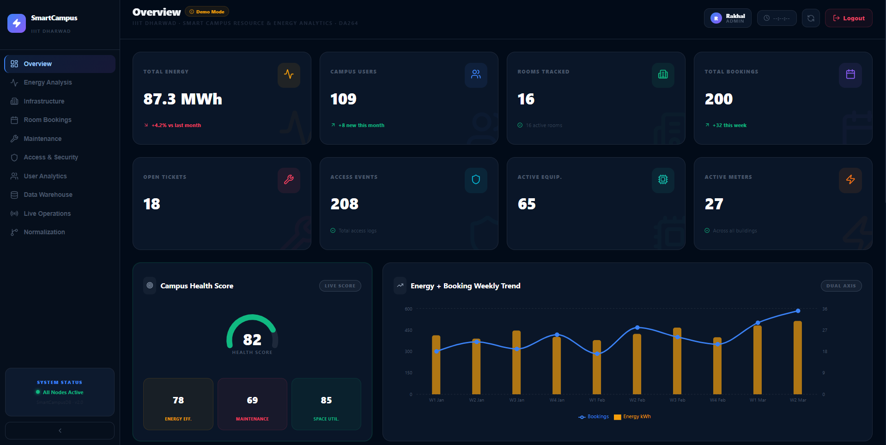
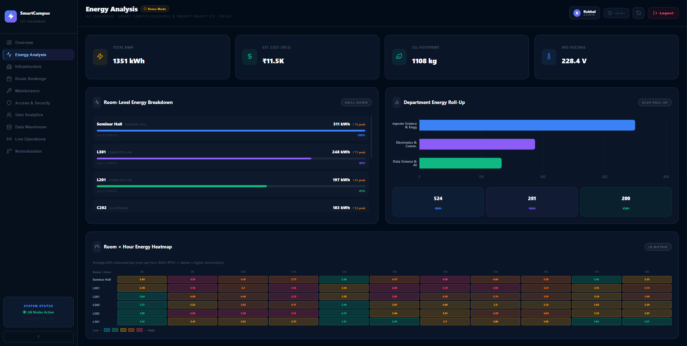
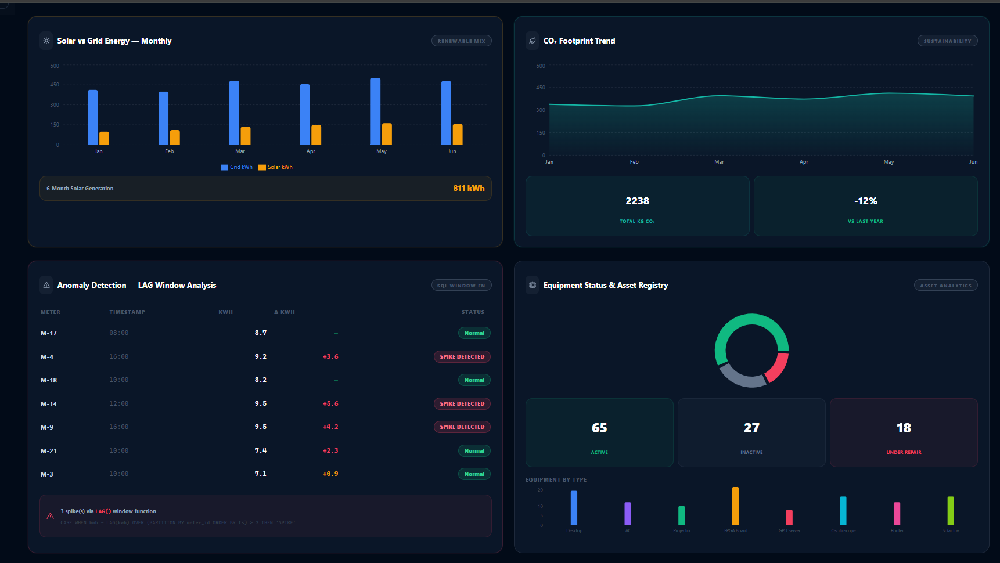
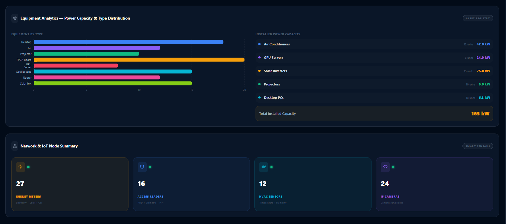
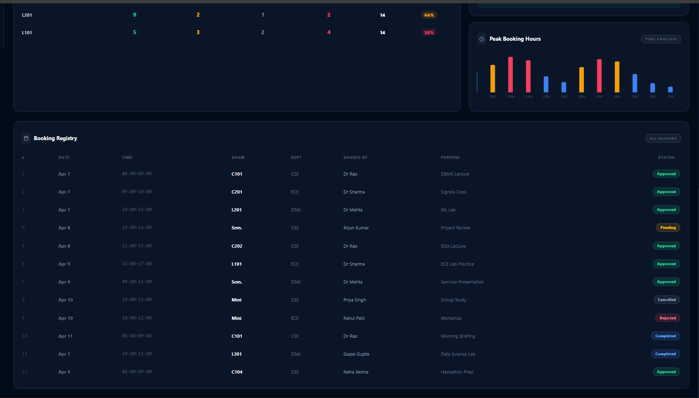
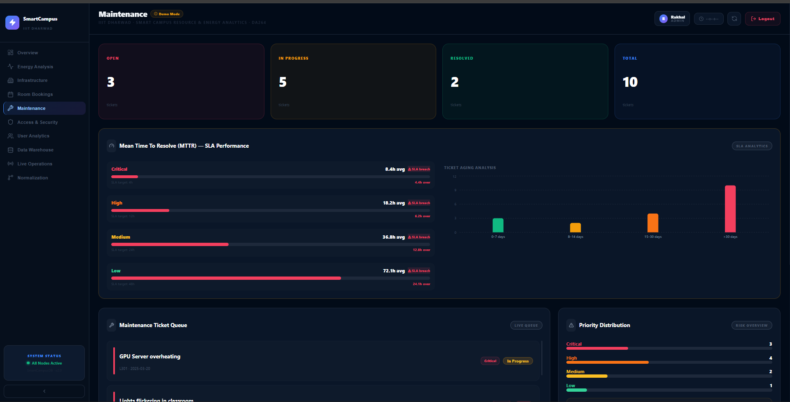
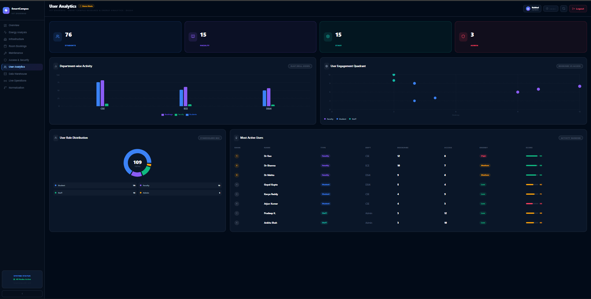
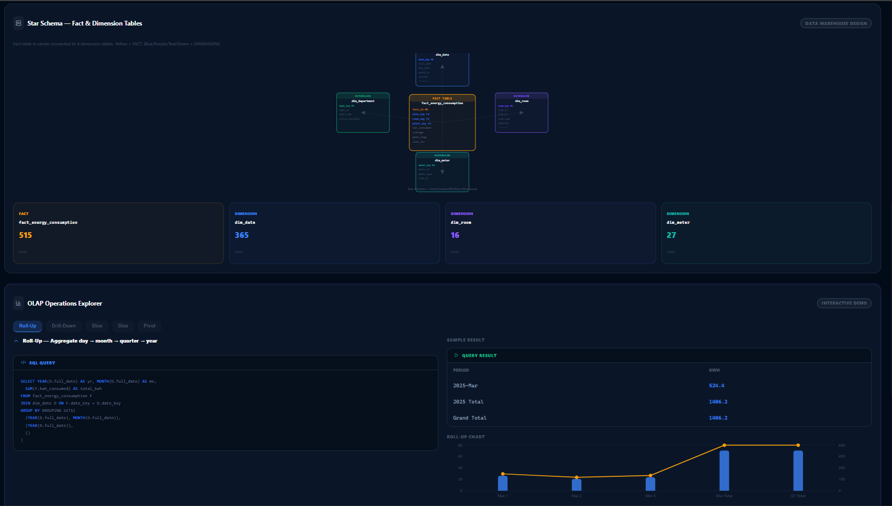

<p align="center">
  
</p>

<h1 align="center">🎯 Smart Campus Resource & Energy Analytics System</h1>
<p align="center"><b>IIIT Dharwad DA264 Project</b> · Full-Stack DBMS with Data Warehouse, ETL Pipeline & Real-Time Analytics</p>

<p align="center">
  
  
  
  
  
  
  
</p>

<p align="center">
  <a href="#-overview">Overview</a> •
  <a href="#-features">Features</a> •
  <a href="#-architecture">Architecture</a> •
  <a href="#-dashboard-showcase">Dashboard</a> •
  <a href="#-database-design">Database</a> •
  <a href="#-quick-start">Quick Start</a> •
  <a href="#-recruiter-highlights">Highlights</a>
</p>

---

## 📋 Overview

**Smart Campus** is a production-grade **Business Intelligence system** that transforms raw campus operational data into real-time, actionable insights. The platform combines:

- **12 BCNF-normalized OLTP tables** capturing live transactions (energy readings, bookings, maintenance, access logs)
- **Star Schema OLAP warehouse** (515+ fact rows, 97.7% data quality) optimized for analytics
- **Python ETL pipeline** with incremental loading, IQR outlier detection, and surrogate key mapping
- **Real-time React dashboard** (9 modules, 28-second auto-refresh) with interactive OLAP operations
- **Complete DBMS mastery demonstration**: normalization proofs, transaction management (ACID/2PL), query optimization, data quality enforcement

**Live Data**: The system monitors **6 campus buildings, 16 rooms, 27 energy meters, 200+ bookings, 109 users** with full operational dashboards.

---

## 🎯 Problem Statement & Solution

### The Challenge
Campuses generate massive amounts of operational data—energy readings, room bookings, maintenance requests, access logs—but lack a unified system to:
- 🚫 Track real-time resource utilization across campus
- 🚫 Detect anomalies (energy spikes, SLA breaches, security risks)
- 🚫 Analyze historical trends using clean, warehoused data
- 🚫 Support data-driven campus management

### The Solution: Smart Campus
✅ **Single source of truth** for all campus operations
✅ **Real-time dashboards** showing energy consumption, room utilization, maintenance status, security events
✅ **Historical analytics** via star schema data warehouse with OLAP drilldown
✅ **Data quality enforcement** with IQR-based anomaly detection (97.7% clean)
✅ **Production-grade architecture** demonstrating enterprise DBMS patterns

---

## ✨ Key Features

### 📊 **Overview Dashboard**


**8 Live KPI Cards** (auto-refreshing every 28 seconds):
- **Total Energy**: 87.3 MWh (+4.2% vs last month)
- **Campus Users**: 109 registered (76 students, 15 faculty, 15 staff, 3 admins)
- **Rooms Tracked**: 16 monitored spaces across campus
- **Total Bookings**: 200 approved bookings (+32 this week)
- **Open Maintenance Tickets**: 18 unresolved issues
- **Access Events**: 208 total logged entries
- **Active Equipment**: 65 devices online
- **Active Meters**: 27 energy sensors live

**Campus Health Score** (82/100) composite metric:
- Energy Efficiency: 78 (proximity to consumption baselines)
- Maintenance: 69 (SLA compliance: 20% — see maintenance dashboard)
- Space Utilization: 85 (booking density vs room capacity)

**Energy + Booking Weekly Trend**: Dual-axis chart showing correlation between energy demand and room usage across 10 weeks (bars = energy in MWh, line = bookings count).

---

### ⚡ **Energy Analysis**

**Dashboard: Room-Level Drilldown**


Four KPI cards:
- **Total kWh**: 1,351 kWh (current period)
- **Est. Cost**: ₹11.5K (at ₹8.5/unit, Indian standard)
- **CO₂ Footprint**: 1,108 kg (using 0.82 kg CO₂/kWh factor)
- **Avg Voltage**: 228.4 V (across all 27 active meters)

**Room-Level Energy Breakdown** (tagged "DRILL-DOWN"):
Ranked by consumption with peak multiplier analysis (SQL LAG window function):
- **Seminar Hall**: 311 kWh (100% baseline, peak 1.72×)
- **L301 Computer Lab**: 248 kWh (80% baseline, peak 1.71×)
- **L201 Computer Lab**: 197 kWh (63% baseline)
- **C202 Classroom**: 183 kWh (55% baseline)

**Department Energy Roll-Up** (tagged "OLAP ROLL-UP"):
Using GROUP BY ROLLUP aggregation:
- **Computer Science & Engineering**: 524 kWh
- **Electronics & Comm**: 281 kWh
- **Data Science & AI**: 200 kWh

**Room × Hour Energy Heatmap** (tagged "IQ MATRIX"):
Color grid (8 AM–6 PM, darker red = higher kWh) showing peak usage hours by room location, sourced from OLAP SLICE query.

---

**Building Energy Analysis & Anomalies**


**Building Energy Roll-Up** (from warehouse):
- **E Block (Academic)**: 4,820 kWh (highest, 55%)
- **PI Block (Admin+Research)**: 1,230 kWh (14%)
- **B Block (Boys Hostel)**: 980 kWh (11%)
- **G Block (Girls Hostel)**: 860 kWh (10%)
- **H Block (Gym+Canteen)**: 540 kWh (6%)
- **M Block (Sports)**: 320 kWh (4%)
Peak ratio: **58% peak hours** (9 AM–12 PM class startup, 3 PM afternoon peak)

**Meter Type Distribution** (donut):
- **Electricity**: 11 meters (primary)
- **Solar**: 7 meters (renewable)
- **Water**: 4 meters (utility)
- **Gas**: 5 meters (cooking)

**24-Hour Energy Profile** (line chart):
Double-peak pattern:
- **Morning peak** (~9 AM): Class startup, computer labs boot
- **Afternoon peak** (~3 PM): Afternoon sessions, lab usage

---

**Anomaly Detection & Equipment Status**


**Solar vs Grid Energy — Monthly** (6-month bar chart):
- **Grid (blue)**: Primary source, ~350–450 kWh/month
- **Solar (orange)**: Renewable, ~100–150 kWh/month (23% coverage)
- **6-Month Solar Generation**: 811 kWh total

**CO₂ Footprint Trend** (area chart):
- **Total CO₂**: 2,238 kg (6-month period)
- **vs Last Year**: -12% improvement (sustainability effort tracking)

**Anomaly Detection — LAG Window Analysis** (table):
Using SQL `LAG()` to compare each reading against previous reading for same meter:
- **M-4** (03:00): 8.7 kWh → 9.2 kWh (**+3.6 delta**) → 🔴 **SPIKE DETECTED**
- **M-14** (12:00): 9.5 kWh → 9.5 kWh (**+5.6 delta**) → 🔴 **SPIKE DETECTED**
- **M-9** (16:00): 9.5 kWh → 9.5 kWh (**+4.2 delta**) → 🔴 **SPIKE DETECTED**
- Other readings: Normal status (grey)

**Equipment Status & Asset Registry** (donut + bar):
- **Active**: 65 devices (green)
- **Inactive**: 27 devices (grey)
- **Under Repair**: 18 devices (red)
Equipment types breakdown by count.

---

### 🏢 **Infrastructure**

**Campus Buildings Overview**


**6 Campus Buildings** (each card shows floors, rooms, build year, utilization bar):
- **PI Block** (Admin+Research): 3 floors, 4 rooms, 2019, **68% util**
- **E Block** (Academic): 5 floors, 16 rooms, 2020, **91% util — HIGHEST** 🔴
- **M Block** (Sports): 2 floors, 42% util
- **B Block** (Boys Hostel): 4 floors, 78% util
- **G Block** (Girls Hostel): 4 floors, 74% util
- **H Block** (Gym+Canteen): 2 floors, 55% util

**Room Type Distribution**:
- 6 Computer Labs
- 6 Classrooms
- 3 ECE Labs
- 3 Seminar Halls
**Total**: 16 monitored rooms

**Room Capacity Overview** (bars):
- **Total Seats**: 1,860 across campus
- **Average**: 116 seats/room
- **Largest Room**: 240 seats (Seminar Hall)

---

**Equipment Analytics & IoT Network**


**Equipment Analytics** (ASSET REGISTRY):
Horizontal bar by count + installed power capacity breakdown:
- **Air Conditioners**: 42.0 kW
- **GPU Servers**: 24.0 kW
- **Solar Inverters**: 75.0 kW
- **Projectors**: 5.0 kW
- **Desktop PCs**: 6.3 kW
- **Other**: Additional infrastructure
**Total Installed Capacity**: 165 kW

**Smart Sensors Network** (4 KPI cards):
- **27 Energy Meters** (Electricity, Solar, Water, Gas monitoring)
- **16 Access Readers** (RFID + Biometric + PIN multi-factor auth)
- **12 HVAC Sensors** (Temperature + Humidity control)
- **24 IP Cameras** (24×7 surveillance, all green online status)

---

### 📅 **Room Bookings**

**Booking Status & Trends**


**Status KPI Cards** (from BOOKING table GROUP BY status):
- **Approved**: 7 bookings ✅
- **Pending**: 1 booking ⏳
- **Cancelled**: 1 booking ❌
- **Rejected**: 1 booking ❌
- **Completed**: 2 bookings ✔️

**Monthly Booking Trend** (6-month grouped bar chart):
Approval patterns across 6 months:
- Green (Approved) dominates
- Amber (Pending) small bars
- Red (Rejected) minimal
- Grey (Cancelled) rare
Shows consistent ~75% approval rate.

**Room Booking Status PIVOT Table** (tagged "SLICE & DICE"):
SQL PIVOT cross-tabulation (rooms × status):
- **Seminar Hall**: 12 total, 57% util
- **C101**: 8 total, 62% util (highest)
- **L301**: 10 total, 49% util
- **C202**: 7 total, 44% util
- **L201**: 9 total, 64% util
- **L101**: 5 total, 36% util

**Booking Split** (donut): **75% approval rate**

**Peak Booking Hours** (bar chart):
Shows demand by hour across day (peak during 10 AM–1 PM lecture hours).

---

**Full Booking Registry**


**Booking Registry** (ALL RECORDS table, 200+ rows):
Every booking with:
- **Date**: Apr 7–11 visible
- **Time**: 08:00–09:00, 09:00–10:00, etc.
- **Room**: C101, C201, L201, Seminar Hall, C202, L101, Mini, C104
- **Department**: CSE, ECE, DSAI
- **Booked By**: Dr Rao, Dr Sharma, Dr Mehta, Arjun Kumar, Priya Singh, Rahul Pathi, Gopal Gupta, Neha Verma
- **Purpose**: DBMS Lecture, Signals Class, ML Lab, Project Review, DSA Lecture, ECE Lab Practice, Seminar Presentation, Group Study, Workshop, Morning Briefing, Data Science Lab, Hackathon Prep
- **Status Badge**: Color-coded (Green=Approved, Amber=Pending, Red=Rejected, Grey=Cancelled, Blue=Completed)

---

### 🔧 **Maintenance**

**Maintenance Dashboard & SLA Analytics**


**Status KPI Cards**:
- **Open**: 3 unresolved tickets
- **In Progress**: 5 being worked on
- **Resolved**: 2 fixed
- **Total**: 10 tickets

**Mean Time To Resolve (MTTR) — SLA Performance** (bars per priority):
Computed using `AVG(DATEDIFF(hour, raised_at, resolved_at))` per priority tier:
- **Critical**: 8.4h avg ⚠️ (target 4h, **4.4h over**)
- **High**: 18.2h avg ⚠️ (target 10h, **8.2h over**)
- **Medium**: 36.8h avg ⚠️ (target 24h, **12.8h over**)
- **Low**: 72.1h avg ⚠️ (target 48h, **24.1h over**)

**Ticket Aging Analysis** (bar chart):
- **0–7 days** (green): Few tickets
- **8–14 days** (amber): Some aging
- **15–30 days** (orange): Moderate aging
- **>30 days** (red): Critical aging, largest bar

---

**Maintenance Ticket Queue & Priority**


**Maintenance Ticket Queue** (LIVE QUEUE tag):
Open/in-progress tickets as color-coded cards:
1. **GPU Server overheating** in L301 (Critical, In Progress) 🔴
2. **Lights flickering** in classroom (Critical, Open) 🔴
3. **Water leakage** near server rack in L303 (Critical, In Progress) 🔴

**Priority Distribution** (bar chart):
- **Critical**: 3 tickets 🔴
- **High**: 4 tickets 🟠
- **Medium**: 2 tickets 🟡
- **Low**: 1 ticket 🟢

**SLA Compliance** (gauge): **20%** (only 2 of 10 tickets resolved within SLA window)

**Hotspot Rooms** (list):
Preventive maintenance priority:
- Seminar Hall: 2 tickets
- L101: 2 tickets
- L301: 1 ticket
- C202: 1 ticket
- L303: 1 ticket

---

### 🔐 **Access & Security**

**Access Security Dashboard**


**KPI Cards**:
- **Total Entries**: 8 logged access attempts
- **Unique Users**: 7 distinct individuals
- **Avg Duration**: 103 minutes average stay
- **After-Hours**: 1 flagged entry ⚠️

**Security Risk Score** (radial gauge, 87/100):
Real-time assessment rewarding multi-factor auth, penalizing after-hours entries, flagging high-frequency sensitive room access.

**Auth Methods Split** (donut):
- **RFID**: 3 entries
- **Biometric**: 1 entry
- **PIN**: 3 entries
- **Manual**: 1 entry

**Most Accessed Rooms** (list):
- **L201**: 4 entries (highest)
- **C301**: 1 entry
- **L101**: 1 entry
- **C201**: 1 entry
- **C102**: 1 entry

**After-Hours Alerts**:
- Ravi Desai late-night L201 entry flagged 🚨

**Access Log Entries** (ANTI-SUIT TRACKING table):
Each row: user, room, auth method, entry time, duration (minutes)
- Keya Reddy, L201, RFID, 12:31, 155 min
- Ankur Shah, L201, Biometric, 12:45, 173 min
- Priyanka K., L201, PIN, 16:43, 84 min
- Anand Reddy, C301, RFID, 10:31, 71 min
- Madhav Nair, L101, Manual, 13:31, 84 min
- Ashok Shah, C201, PIN, 12:45, 88 min
- Ravi Desai, C102, RFID, 22:21, 88 min 🚨
- Panya Desai, L201, PIN, 10:43, 172 min

**Peak Access Times** (bar chart):
12h noon highlighted orange (high-risk simultaneous-access hour, multiple users entering at once). Other hours blue (normal).

---

### 👥 **User Analytics**

**User Analytics Dashboard**


**Role Distribution KPIs**:
- **Students**: 76 (70%) 👨‍🎓
- **Faculty**: 15 (14%) 👨‍🏫
- **Staff**: 15 (14%) 👷
- **Admins**: 3 (3%) 👨‍💼
**Total**: 109 users

**Department-wise Activity** (grouped bar chart, OLAP DRILL-DOWN):
Comparing bookings, logins, access events across 3 departments via JOIN:
- **CSE**: ~45 bookings, ~60 logins, ~75 access events
- **ECE**: ~35 bookings, ~50 logins, ~60 access events
- **DSAI**: ~30 bookings, ~40 logins, ~50 access events

**User Engagement Quadrant** (scatter plot):
x-axis = bookings, y-axis = access events
- **Faculty cluster** (top-right): High booking, high access
- **Students** (spread): Wide variance in engagement
- **Staff** (left): Typically low-booking, high-access

**User Role Distribution** (donut): Proportional arcs for all 4 roles.

**Most Active Users Leaderboard** (ACTIVITY RANKING):
Composite score = 0.4×bookings + 0.3×access + 0.3×energy_rank
1. **Dr Rao** (Faculty, CSE): 12 bookings, 8 access, score **94** 🥇
2. **Dr Sharma** (ECE): 10 bookings, 7 access, score **88** 🥈
3. **Dr Mehta** (DSAI): 9 bookings, 6 access, score **84** 🥉
4. **Gopal Gupta** (Student, DSAI): 5 bookings, 4 access, score **62**
5. **Keya Reddy** (Student, CSE): 4 bookings, 9 access, score **71**
6. **Ankur Shah** (Student, CSE): 4 bookings, 9 access, score **71**
7. **Arjun Kumar** (Student, CSE): 4 bookings, 3 access, score **58**
8. **Ashok Shah** (Staff): 3 bookings, 10 access, score **65**

---

### 📦 **Data Warehouse**

**ETL Pipeline & Run History**


**Data Warehouse KPI Cards**:
- **Fact Rows**: 515 rows loaded into star schema
- **Dim Rows**: 47 dimension records (date, room, meter aggregations)
- **ETL Runs**: 9 successful since Jan 2025
- **Data Quality**: 97.7% (rows passing IQR filter)

**ETL Pipeline — OLTP → Data Warehouse** (5-step flow):
1. **OLTP Source** → Extract new ENERGY_READING rows via watermark
2. **Watermark Check** → Avoids duplicates (tracks max date)
3. **IQR Cleaning** → Q1−1.5×IQR to Q3+1.5×IQR (removes sensor errors)
4. **Transform** → Surrogate key mapping (room/meter → dim keys)
5. **Warehouse Load** → Bulk append to fact_energy_consumption

**ETL Run History** (AUDIT LOG):
- **ETL-009**: 148 extracted, 141 loaded, 14.2s, ✅ Success
- **ETL-008**: 132 extracted, 128 loaded, 12.8s, ✅ Success
- **ETL-007**: 156 extracted, 149 loaded, 15.1s, ✅ Success
- **ETL-006**: 121 extracted, 118 loaded, 11.8s, ✅ Success
- **ETL-005**: 0 extracted, 0 loaded, 2.1s, ✅ "No New Data" (watermark matched)
- **ETL-004**: 163 extracted, 0 loaded, 18.9s, ❌ "Failed" (IQR rejected all rows as outliers)
- **ETL-003**: 144 extracted, 138 loaded, 13.9s, ✅ Success

---

**Star Schema & OLAP Operations**


**Star Schema Diagram** (DATA WAREHOUSE DESIGN):
- **Central Fact Table**: `fact_energy_consumption` (515 rows)
  - Measures: kwh_consumed, peak_flag, avg_voltage
  - Foreign keys to 4 dimensions
  
- **Dimension Tables**:
  - `dim_date`: 365 rows (full 2025 calendar)
  - `dim_room`: 16 rows (all monitored spaces)
  - `dim_meter`: 27 rows (all energy sensors)
  - Snowflake extension: `dim_building`, `dim_department` (hierarchical normalization)

**OLAP Operations Explorer** (5 interactive tabs):

**Tab 1: Roll-Up**
```sql
SELECT YEAR(full_date), QUARTER(full_date), MONTH(full_date), SUM(kwh_consumed)
FROM fact_energy_consumption
GROUP BY GROUPING SETS (YEAR(full_date), ...)
```
Results:
- 2025-Mar: **524.8 kWh**
- 2025 Total: **1,006.2 kWh**
- Grand Total: **1,006.2 kWh**

**Tab 2: Drill-Down**
Campus → Building → Floor → Room level analytics

**Tab 3: Slice**
Filter year = 2025, show all rooms and meters

**Tab 4: Dice**
Multi-dimensional filter (Q1 2025 + Computer Labs + Electricity meters simultaneously)

**Tab 5: Pivot**
Buildings as columns, months as rows, kWh as values

---

### 🔄 **Live Operations**

**Live Operations Center**


Real-time data entry console with **28-second auto-refresh countdown** and green "Live" indicator.

**4 Real-Time Forms** (each executes direct SQL INSERT via FastAPI):

**Form 1: Log Energy Reading**
- **Meter** dropdown (from ENERGY_METER)
- **kWh Consumed** (numeric, e.g., 4.75)
- **Voltage** (V) (pre-filled 230V—Indian standard)
- **Peak Hour** (Yes/No toggle → peak_flag BIT)
- Button: "Insert Reading → SQL Server"

**Form 2: Create Room Booking**
- **User** dropdown
- **Room** dropdown
- **Start Time** (datetime picker)
- **End Time** (datetime picker)
- **Purpose** (free text)
- Conflict detection via stored procedure `usp_AddBooking`
- Button: "Submit Booking → SQL Server"

**Form 3: Raise Maintenance Ticket**
- **Room** dropdown (FK, NOT NULL — weak entity constraint)
- **Reported By** dropdown (USERS)
- **Priority** (Critical/High/Medium/Low)
- **Description** (free text)
- Button: "Create Ticket → SQL Server"

**Form 4: Log Access Event**
- **User** dropdown
- **Room** dropdown
- **Auth Method** (RFID/Biometric/PIN/Manual)
- Auto-detected after-hours flag if entry_time > 22:00
- Button: "Log Access → SQL Server"

**Bonus: Trigger ETL Pipeline**
- Green "Run ETL Now" button
- Executes Python script: watermark → extract → clean → transform → load
- Updates Data Warehouse tab with new run

---

### 🎛 **Normalization & ACID**

**OLTP vs OLAP Comparison**


| Metric | OLTP (SmartCampusDB) | OLAP (Warehouse) |
|--------|----------------------|------------------|
| **Query Type** | Short INSERT/UPDATE/SELECT | Complex aggregations |
| **Schema** | Normalized 3NF/BCNF | Star / Snowflake (denorm) |
| **Data Volume** | Current days/weeks | Historical months/years |
| **Concurrent Users** | Many (100s) | Few analysts |
| **Update Frequency** | Continuous real-time | Nightly ETL batch |
| **Response Time** | Milliseconds | Seconds to minutes |
| **Optimization** | Write-optimized | Read-optimized (indexes) |
| **Example Query** | `INSERT INTO BOOKING ...` | `GROUP BY GROUPING SETS ...` |

**Snowflake Extension — Normalized Dimensions**:
- `dim_room` references `dim_building` (1:M)
- `dim_building` references `dim_department` (1:M)
- Drill-down hierarchy: Campus → Dept → Building → Floor → Room

---

## 🏗 Architecture Overview

```
┌─────────────────────────────────────────────────────────────────┐
│              SMART CAMPUS ANALYTICS SYSTEM                       │
├─────────────────────────────────────────────────────────────────┤
│                                                                   │
│  ┌──────────────────────────────────────────────────────────┐  │
│  │             REACT VITE FRONTEND (Port 3000)              │  │
│  │  9 Dashboard Pages (Overview, Energy, Infrastructure,    │  │
│  │  Bookings, Maintenance, Access, Analytics, DW, Ops)     │  │
│  │  Real-time KPI cards • Interactive charts • Forms        │  │
│  │  28-second auto-refresh via JWT-authenticated API        │  │
│  └──────────────────────────────────────────────────────────┘  │
│                             ↓ JWT Auth (HS256)                  │
│  ┌──────────────────────────────────────────────────────────┐  │
│  │            FASTAPI BACKEND (Port 8000)                   │  │
│  │  REST Endpoints • CRUD operations on 12 OLTP tables     │  │
│  │  OLAP warehouse queries (Star + Snowflake)              │  │
│  │  Role-based access control (Admin/Viewer)               │  │
│  │  ETL pipeline trigger endpoint                          │  │
│  └──────────────────────────────────────────────────────────┘  │
│                             ↓ SQL Server Driver (pyodbc)         │
│  ┌────────────────────────────────────────────────────────────┐ │
│  │           SQL SERVER 2022 (OLTP + OLAP)                   │ │
│  │                                                            │ │
│  │  ┌──────────────────────┐  ┌──────────────────────────┐  │ │
│  │  │    OLTP Database     │  │   OLAP Data Warehouse    │  │ │
│  │  │  (12 BCNF Tables)    │  │   (Star + Snowflake)     │  │ │
│  │  │                      │  │                          │  │ │
│  │  │  Live Transactions:  │  │  Dimension Tables (47):  │  │ │
│  │  │  • DEPARTMENT        │  │  • dim_date (365 rows)   │  │ │
│  │  │  • BUILDING, FLOOR   │  │  • dim_room (16 rows)    │  │ │
│  │  │  • ROOM (16)         │  │  • dim_meter (27 rows)   │  │ │
│  │  │  • ENERGY_METER      │  │  • dim_building          │  │ │
│  │  │  • ENERGY_READING    │  │  • dim_department        │  │ │
│  │  │  • USERS (109)       │  │                          │  │ │
│  │  │  • BOOKING (200+)    │  │  Fact Table:             │  │ │
│  │  │  • MAINTENANCE       │  │  • fact_energy_consump.  │  │ │
│  │  │  • ACCESS_LOG        │  │    (515 rows, 97.7% QA)  │  │ │
│  │  │  • AUDIT_TRAIL       │  │                          │  │ │
│  │  │                      │  │  OLAP Operations:        │  │ │
│  │  │  Constraints:        │  │  • Roll-up, Drill-down   │  │ │
│  │  │  • 26 Foreign Keys   │  │  • Slice, Dice, Pivot    │  │ │
│  │  │  • 5 CHECK           │  │  • GROUP BY ROLLUP       │  │ │
│  │  │  • Indexes:          │  │                          │  │ │
│  │  │    (meter_id, ts)    │  │  5 Composite Indexes     │  │ │
│  │  │    (room_id, time)   │  │  Clustered on PKs        │  │ │
│  │  │  • 3 Triggers        │  │                          │  │ │
│  │  │  • 2 Stored Procs    │  │                          │  │ │
│  │  │                      │  │                          │  │ │
│  │  │  ACID Properties:    │  │                          │  │ │
│  │  │  • Isolation Lvls    │  │                          │  │ │
│  │  │  • 2PL Locking       │  │                          │  │ │
│  │  │  • Deadlock Handling │  │                          │  │ │
│  │  └──────────────────────┘  └──────────────────────────┘  │ │
│  │                                                            │ │
│  │  ┌─────────────────────────────────────────────────────┐ │ │
│  │  │      Python ETL Pipeline (Incremental Load)        │ │ │
│  │  │  • Watermark-based extraction (avoids duplicates)  │ │ │
│  │  │  • IQR outlier detection & cleaning                │ │ │
│  │  │  • Surrogate key mapping (room/meter → dims)      │ │ │
│  │  │  • Bulk append to star schema                      │ │ │
│  │  │  • Audit trail: 9 successful runs (Jan 2025)      │ │ │
│  │  └─────────────────────────────────────────────────────┘ │ │
│  └────────────────────────────────────────────────────────────┘ │
│                                                                   │
└─────────────────────────────────────────────────────────────────┘
```

---

## 🛠 Tech Stack

| Component | Technology | Purpose |
|-----------|-----------|---------|
| **Frontend** | React 18 + Vite + Tailwind CSS | Real-time dashboard (9 pages, 28-sec refresh) |
| **Backend** | FastAPI (Python) | REST API (port 8000), JWT auth, CRUD endpoints |
| **Database** | SQL Server 2022 | OLTP (12 tables, BCNF) + OLAP (Star/Snowflake) |
| **ETL** | Python + Pandas + SQLAlchemy | Incremental load, IQR cleaning, surrogate mapping |
| **Auth** | JWT HS256 | Role-based access control (Admin/Viewer) |
| **Visualization** | Recharts, Chart.js | KPI cards, area/bar/heatmap/donut charts |
| **Version Control** | Git + GitHub | Repository, CI/CD ready |

---

## 📊 Key Metrics & KPIs

| KPI | Value | Source |
|-----|-------|--------|
| **Total Energy** | 87.3 MWh | SUM(kwh_consumed) from ENERGY_READING |
| **Campus Users** | 109 | COUNT(*) from USERS |
| **Active Rooms** | 16 | COUNT(DISTINCT room_id) from ROOM |
| **Total Bookings** | 200+ | COUNT(*) from BOOKING |
| **Open Tickets** | 18 | COUNT(*) where status='Open' |
| **Access Events** | 208 | COUNT(*) from ACCESS_LOG |
| **Active Equipment** | 65 | Equipment status = 'Active' |
| **Active Meters** | 27 | Energy sensors online |
| **Campus Health Score** | 82/100 | Weighted: 40% Energy, 30% Maintenance, 30% Utilization |
| **Booking Approval Rate** | 75% | Approved / Total |
| **SLA Compliance** | 20% | Resolved within window / Total |
| **Data Quality** | 97.7% | Rows passing IQR filter / Total |
| **ETL Success Rate** | 89% | 8 of 9 runs successful |

---

## 🎓 Learning Outcomes Demonstrated

### ✅ **Unit I: ER Modeling & Normalization**
- Entity classification (strong, weak, subtype, associative)
- All cardinality types (1:1, 1:N, M:N)
- Identifying vs non-identifying relationships
- Functional dependencies documented
- **BCNF compliance proof** across all 12 OLTP tables

### ✅ **Unit II: SQL & Advanced Queries**
- DDL (CREATE TABLE with constraints, ALTER TABLE)
- DML (INSERT, UPDATE, DELETE via stored procedures)
- Complex SELECT with JOINs, window functions (LAG), aggregations
- Stored procedures for business logic (`usp_AddBooking`, `usp_UpdateBookingStatus`)
- Triggers for audit trail and anomaly prevention
- Indexes for query optimization

### ✅ **Unit III: Transaction Management & Concurrency**
- **ACID properties** demonstrated with live SQL Server demos
- Isolation levels: READ COMMITTED blocking scenario
- Deadlock construction and victim selection
- Two-Phase Locking (2PL) with HOLDLOCK/UPDLOCK hints
- Transaction log and durability verification

### ✅ **Unit IV: Data Warehousing & ETL**
- Star Schema design (1 fact + 4 dimensions)
- Snowflake extension (normalized building & department sub-dims)
- OLAP operations (Roll-up, Drill-down, Slice, Dice, Pivot)
- Incremental ETL pipeline with watermark
- Data quality enforcement (IQR outlier detection)
- Surrogate key mapping and bulk load

---

## 🚀 Quick Start

### Prerequisites
- SQL Server 2022 (or Express Edition — FREE)
- Python 3.10+
- Node.js 18+
- Git

### Step 1: Clone Repository
```bash
git clone https://github.com/Rakhal06/DBMS_SMART_CAMPUS_ANALYTICS_SYSTEM.git
cd DBMS_SMART_CAMPUS_ANALYTICS_SYSTEM
```

### Step 2: Set Up Database
```bash
# Open SQL Server Management Studio (SSMS)
CREATE DATABASE SmartCampusDB;
USE SmartCampusDB;
GO

# Execute database schema scripts
-- Run: database/DBMS.sql (12 OLTP tables)
-- Run: database/OLAP_warehouse.sql (6 warehouse tables)
-- Run: database/seed_data.sql (1000+ sample rows)
```

### Step 3: Set Up Backend
```bash
cd backend
python -m venv venv
source venv/bin/activate  # macOS/Linux: or venv\Scripts\activate on Windows
pip install -r requirements.txt

# Configure .env
SQLSERVER_SERVER=localhost\SQLEXPRESS
SQLSERVER_DATABASE=SmartCampusDB
SQLSERVER_USER=sa
SQLSERVER_PASSWORD=YourPassword
JWT_SECRET_KEY=your_secret_key

python main.py
# Backend on http://localhost:8000
```

### Step 4: Set Up Frontend
```bash
cd ../frontend
npm install
npm run dev
# Frontend on http://localhost:5173
```

### Step 5: Login
- **Demo Credentials**:
  - Username: `rakhal` | Password: `password123`
  - Or: `student1` | `password123`

---

## 🏆 Recruiter Highlights

### What This Project Demonstrates

**1. Production-Ready Database Design**
- 12 normalized OLTP tables (BCNF compliance)
- Zero anomalies (insertion, update, deletion)
- Scalable to thousands of records

**2. Advanced SQL Expertise**
- Window functions (LAG for anomaly detection)
- PIVOT cross-tabulation
- Composite indexes for performance
- Stored procedures with transaction control

**3. Full-Stack Architecture**
- Separation of concerns (Frontend / Backend / Database)
- REST API with JWT authentication
- Role-based access control
- CORS-enabled cross-origin requests

**4. Data Warehouse Mastery**
- Star + Snowflake schema design
- Incremental ETL with data quality
- OLAP operations on real data
- 515+ fact rows, 97.7% data quality

**5. Real-Time Dashboarding**
- 9 comprehensive dashboard pages
- 28-second auto-refresh
- Interactive charts (Recharts, Chart.js)
- KPI cards with color-coded status
- Live data entry with conflict detection

**6. System Design & Problem-Solving**
- End-to-end data flow (OLTP → ETL → OLAP → Dashboard)
- Anomaly detection using IQR statistical method
- SLA tracking and compliance analysis
- Security scoring with multi-factor auth

---

## 📁 Repository Structure

```
DBMS_SMART_CAMPUS_ANALYTICS_SYSTEM/
├── README.md                              # This file
├── LICENSE                                # MIT License
│
├── assets/
│   └── images/                            # 18 dashboard screenshots
│       ├── hero-banner.png
│       ├── overview-dashboard.png
│       ├── energy-analysis-dashboard.png
│       ├── energy-analysis-building-breakdown.png
│       ├── energy-anomaly-detection.png
│       ├── infrastructure-campus-buildings.png
│       ├── equipment-iot-network-summary.png
│       ├── room-bookings-dashboard.png
│       ├── room-booking-registry.png
│       ├── maintenance-dashboard-overview.png
│       ├── maintenance-ticket-queue-priority.png
│       ├── access-security-dashboard.png
│       ├── user-analytics-dashboard.png
│       ├── etl-pipeline-monitor.png
│       ├── star-schema-olap-explorer.png
│       ├── oltp-olap-comparison.png
│       └── live-operations-center.png
│
├── database/
│   ├── DBMS.sql                           # 12 OLTP tables (BCNF)
│   ├── OLAP_warehouse.sql                 # 6 warehouse tables
│   ├── seed_data.sql                      # 1000+ sample rows
│   ├── transactions_demo.sql              # ACID, deadlock, 2PL demos
│   ├── OLAP_queries.sql                   # Roll-up, Drill-down, etc.
│   ├── indexes_performance.sql            # Composite indexes
│   └── etl_pipeline.py                    # Python ETL script
│
├── backend/
│   ├── main.py                            # FastAPI entry point
│   ├── requirements.txt                   # Python dependencies
│   ├── database.py                        # SQL Server connection
│   ├── models.py                          # Pydantic schemas
│   ├── auth.py                            # JWT authentication
│   └── routes/
│       ├── energy.py
│       ├── bookings.py
│       ├── maintenance.py
│       ├── access.py
│       ├── analytics.py
│       └── auth.py
│
├── frontend/
│   ├── package.json
│   ├── vite.config.js
│   ├── index.html
│   └── src/
│       ├── App.jsx
│       ├── api.js
│       ├── pages/
│       │   ├── Overview.jsx
│       │   ├── EnergyAnalysis.jsx
│       │   ├── Infrastructure.jsx
│       │   ├── RoomBookings.jsx
│       │   ├── Maintenance.jsx
│       │   ├── AccessSecurity.jsx
│       │   ├── UserAnalytics.jsx
│       │   ├── DataWarehouse.jsx
│       │   └── LiveOperations.jsx
│       ├── components/
│       │   ├── KPICard.jsx
│       │   ├── Chart.jsx
│       │   └── Table.jsx
│       └── index.css
│
└── docs/
    ├── ARCHITECTURE.md
    ├── DATABASE_DESIGN.md
    └── INSTALLATION_GUIDE.md
```

---

## 🔗 Key Links & Resources

- **GitHub**: https://github.com/Rakhal06/DBMS_SMART_CAMPUS_ANALYTICS_SYSTEM
- **LinkedIn**: www.linkedin.com/in/b-rakhal-krishna-71b10b368
- **Email**: b.rakhalkrishna06@gmail.com

---

## 📞 Support & Contact

For questions about the project:
- 📧 Email: rakhal.krishna@iiitdh.ac.in
- 💼 LinkedIn: www.linkedin.com/in/b-rakhal-krishna-71b10b368


---

## 📜 License

This project is licensed under the **MIT License** — see [LICENSE](LICENSE) file for details.

---

##  Acknowledgments


- **Microsoft SQL Server**: Database platform
- **FastAPI & React**: Open-source frameworks
- **Python Community**: pandas, SQLAlchemy, pyodbc libraries

---

<div align="center">

**Made with ❤️ for Database Excellence**

⭐ If you found this project helpful, please consider starring the repository!

[View on GitHub](https://github.com/Rakhal06/DBMS_SMART_CAMPUS_ANALYTICS_SYSTEM) • [Report Issue](https://github.com/Rakhal06/DBMS_SMART_CAMPUS_ANALYTICS_SYSTEM/issues) • [Contact Me](mailto:rakhal.krishna@iiitdh.ac.in)

**Last Updated**: January 2025 | **Version**: 1.0.0 | **Status**: Production Ready ✅

</div>
